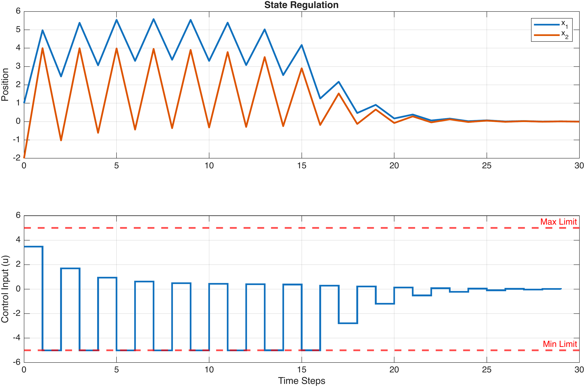
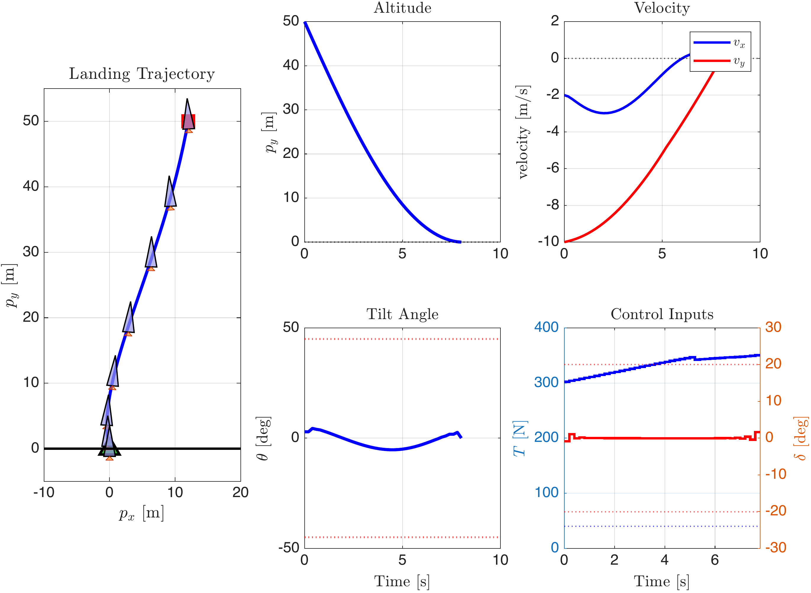
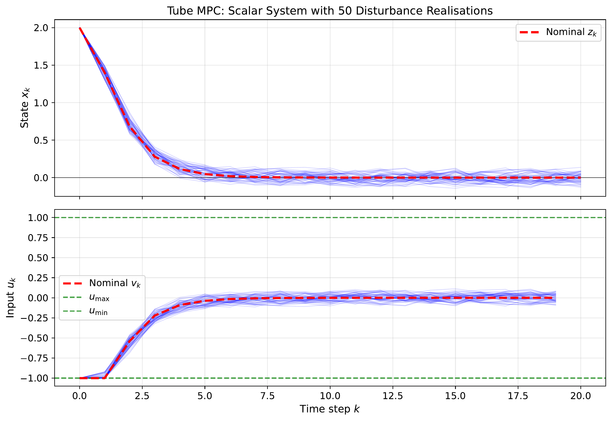
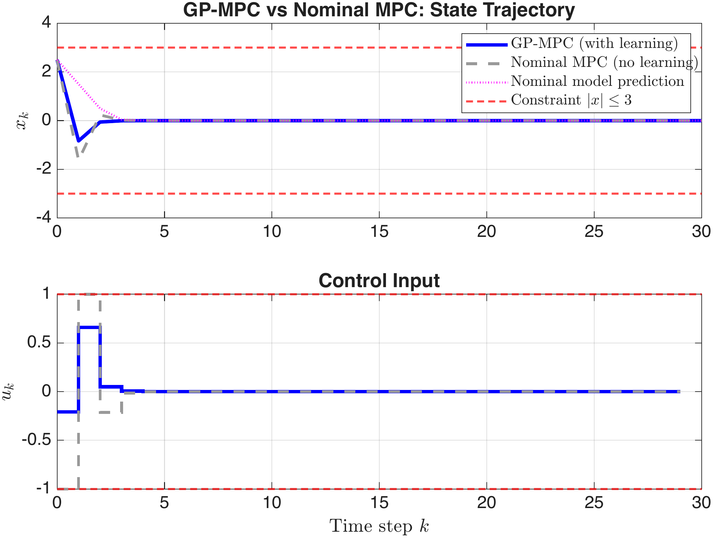

# Model Predictive Control: From Foundations to Advanced Topics

**Author:** Ibrahim Kucukdemiral
**License:** [CC BY-NC 4.0](https://creativecommons.org/licenses/by-nc/4.0/)
**Status:** Open-access book (Zenodo publication forthcoming)

---

## About

This open-access book provides a comprehensive, practical introduction to Model Predictive Control (MPC). Starting from optimisation, state-space modelling, and classical optimal control, it builds towards the formulation, analysis, and implementation of constrained MPC for linear, robust, nonlinear, and learning-based systems.

Every chapter includes worked examples, MATLAB/YALMIP code, and exercises. The book is suitable as a companion to a graduate course or as a self-contained resource for independent study.

## Table of Contents

### Core Chapters
| Chapter | Topic |
|---------|-------|
| 1 | Introduction to MPC |
| 2 | Optimisation: The Engine of MPC |
| 3 | State-Space Models and Discretisation |
| 4 | Controllability and Observability |
| 5 | Linear Quadratic Regulator (LQR) |
| 6 | The Kalman Filter |
| 7 | Linear Model Predictive Control |
| 8 | Output-Feedback and Offset-Free MPC |

### Supplementary Chapters (*)
| Chapter | Topic |
|---------|-------|
| 9 | MPC Implementation in Simulink |
| 10 | Robust and Tube MPC |
| 11 | Nonlinear Model Predictive Control |
| 12 | MPC with Learning |
| 13 | Conclusion and Further Topics |

### Appendices
| | Topic |
|---|-------|
| A | Linear Algebra Review |
| B | Probability and Random Variables |

## Software Requirements

- **MATLAB** R2019b or later
- **Control System Toolbox** and **Optimization Toolbox**
- **[YALMIP](https://yalmip.github.io)** (free) -- used in every MPC chapter
- **[MPT3](https://www.mpt3.org)** (free) -- polytopic sets in Chapters 7 and 10
- **[CasADi](https://web.casadi.org)** (free) -- nonlinear MPC in Chapter 11

Optional: Statistics and Machine Learning Toolbox, Deep Learning Toolbox, Simulink.

## Building the Book

```bash
pdflatex Main.tex
bibtex Main
pdflatex Main.tex
pdflatex Main.tex
```

## Selected Figures

<p align="center">
  
  
</p>
<p align="center">
  
  
</p>

## Citation

```bibtex
@book{kucukdemiral2026mpc,
  author    = {K{\"u}{\c{c}}{\"u}kdemiral, {\.I}brahim},
  title     = {Model Predictive Control: From Foundations to Advanced Topics},
  year      = {2026},
  publisher = {Zenodo},
  doi       = {10.5281/zenodo.XXXXXXX},
  license   = {CC BY-NC 4.0}
}
```

## License

This work is licensed under the [Creative Commons Attribution-NonCommercial 4.0 International License](https://creativecommons.org/licenses/by-nc/4.0/).
